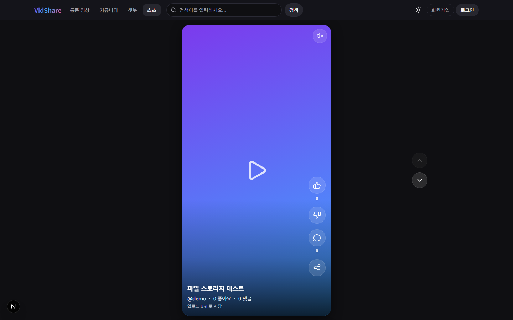
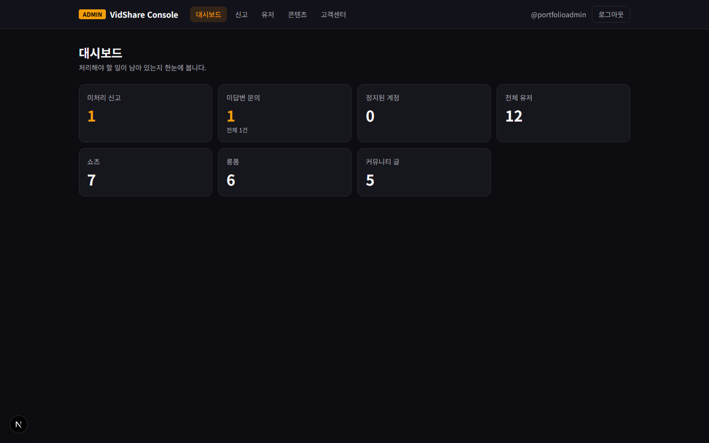
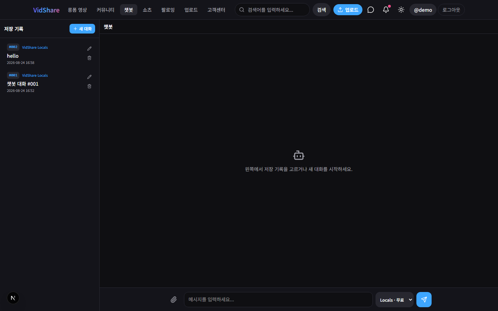
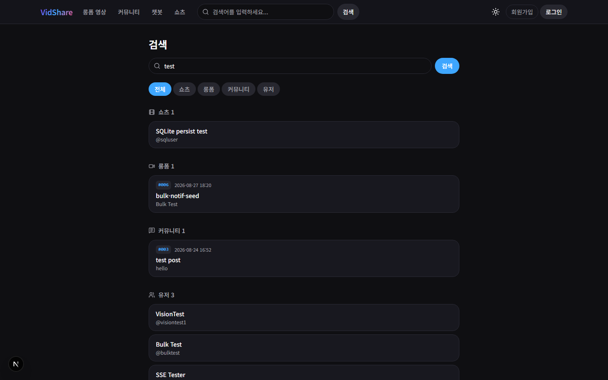

# VidShare

> **쇼츠 · 롱폼 · 커뮤니티 · 실시간 메시지 · AI 챗봇**을 하나로 묶은 영상 공유 플랫폼.
> 사용자 웹앱 · 관리자 콘솔 · REST API 서버를 직접 설계하고 구현한 개인 프로젝트입니다.


| | 링크 |
|---|---|
| 사용자 사이트 | https://vidshare-front.limjinheng0120.workers.dev |
| 관리자 콘솔 | https://vidshare-console.limjinheng0120.workers.dev |
| 포트폴리오 | [portfolio/](./portfolio/) — 문서(Markdown·DOCX) + 소개 사이트 |
| 구조 문서 | [docs/architecture/overview.md](./docs/architecture/overview.md) |

> 배포된 프론트는 공개 백엔드 주소가 연결되기 전까지 **UI 확인용**입니다.
> 전체 기능은 아래 [빠른 시작](#빠른-시작-실행-방법)으로 로컬에서 실행하세요.

---

## 프로젝트 소개

숏폼 하나만 있는 클론이 아니라, **콘텐츠 소비 → 창작 → 소통 → 운영**까지의 한 사이클을
직접 만들어 보는 것이 목표였습니다. 그래서 사용자 앱과 별개로 **관리자 콘솔을 독립 앱으로
분리**했고, 신고·정지·삭제·문의 답변 같은 운영 동선을 실제로 돌아가게 구현했습니다.

설계에서 특히 신경 쓴 부분:

- **3-앱 분리** — 사용자(3000) · 관리자(3200) · API(4000). 세션 쿠키 이름까지 분리해
  (`vidshare_sid` / `vidshare_admin_sid`) 같은 브라우저에서 두 세션이 서로를 덮지 않습니다.
- **단일 통신 창구** — 프론트는 `lib/api.ts` 를 거치지 않고 `fetch` 하지 않습니다.
  모든 응답은 `{ success, data?, error? }` 한 가지 형태(`ApiResult<T>`)로 통일했습니다.
- **실시간 2종** — 알림은 SSE, 메시지는 WebSocket. 목적에 맞는 프로토콜을 각각 선택했습니다.
- **직접 만든 AI 챗봇** — LangChain·LangGraph 로 3개 모델 티어(무료/요약/RAG)를 구성하고
  플랫폼 데이터를 코퍼스로 넣어 서비스 문맥을 아는 챗봇을 붙였습니다.
- **기록 남기기** — 커밋 90여 건 각각에 대해 배경·트레이드오프·검증 방법을
  [docs/commits/](./docs/commits/) 에 남겼습니다.

---

## 화면

| | |
|---|---|
|  |  |
| **쇼츠 피드** — 세로 스냅, 좋아요·댓글·공유 | **운영 대시보드** — 미처리 신고·미답변 문의 |
|  |  |
| **AI 챗봇** — 3모델, 대화 저장, 파일 첨부 | **통합 검색** — 쇼츠·롱폼·커뮤니티·유저 |

전체 화면과 설명은 [포트폴리오 사이트](./portfolio/)에 있습니다.

---

## 주요 기능

| 영역 | 내용 |
|------|------|
| 쇼츠 | 세로 스냅 피드, 좋아요/싫어요, 댓글·대댓글, 공유, 실파일 업로드(100MB) |
| 롱폼 | 목록 · 작성 · 상세 |
| 커뮤니티 | 게시글 목록 · 작성 · 상세 |
| 소셜 | 팔로우, 팔로잉 피드, 팔로워/팔로잉 목록, 재생목록, 통합 검색 |
| 메시지 | 대화 목록 · 스레드 · **WebSocket 실시간 송수신** (REST 폴백 유지) |
| 알림 | **SSE 실시간 수신**, 읽음/삭제·벌크 처리, 수신 토글 |
| AI 챗봇 | Locals / Vide / Shape 3티어, RAG, 이미지·PDF·DOCX 멀티모달 첨부 |
| 모더레이션 | 유저·영상·댓글·커뮤니티 신고, 유저 차단(피드 필터링) |
| 관리자 콘솔 | 신고 처리 · 유저 정지 · 콘텐츠 삭제 · 문의 답변 · 운영 대시보드 |
| 인증 | bcrypt + HttpOnly 세션 쿠키, 사용자/관리자 분리 |
| 법적 페이지 | 이용약관 · 개인정보처리방침(조문 근거 포함) · 사업자 정보확인 |

---

## 기술 스택

| 구분 | 사용 기술 |
|------|-----------|
| 프론트엔드 | Next.js 16 (App Router), React 19, TypeScript, Tailwind CSS v4, TanStack Query |
| 백엔드 | Node.js 24, Express 4, TypeScript, `pg`, `ws`, bcrypt, multer |
| AI | LangChain, LangGraph, Google Gemini · Groq |
| 데이터 | PostgreSQL 16 (22개 테이블, 버전 관리 마이그레이션), 디스크 파일 스토리지 |
| 테스트 | `node --test` (백엔드 148건 · 프론트), Playwright E2E 8 시나리오, GitHub Actions CI |
| 배포 | 프론트: Cloudflare Workers (OpenNext) · 백엔드: Oracle Cloud VM (Caddy + systemd) |

---

## 시스템 구성

```
[Browser — 사용자]                    [Browser — 운영자]
       │                                     │
       ▼                                     ▼
[FrontServer :3000]                   [console :3200]
  Next.js · lib/api.ts                  Next.js · lib/adminApi.ts
  쿠키 vidshare_sid                     쿠키 vidshare_admin_sid
       │                                     │
       └────── fetch(credentials: "include") ┘
                        │
                        ▼
             [BackendServer :4000]  Express REST API
                routes/ → data/store.ts → db/client.ts
                /api/*        ← requireRequestUser
                /api/admin/*  ← requireAdmin
                /ws/conversations (WebSocket) · /api/notifications/stream (SSE)
                        │
                        ▼
             [PostgreSQL 16]  로컬: D:\PostgreSQL\16\data · 운영: VM 블록 볼륨
             [Files]   UPLOADS_PATH  (DB엔 /uploads/<uuid>.ext 경로만)
```

```
vidshare/                     ← 이 프로젝트 루트
├── README.md                 ← 지금 이 파일
├── docs/                     ← 아키텍처, 커밋 기록, 배포 가이드, 보안
├── portfolio/                ← 포트폴리오 문서 + 소개 사이트
├── deploy/                   ← Oracle VM · 내 PC(D 드라이브) 배포·백업 스크립트
├── FrontServer/              ← Next.js 프론트엔드 (사용자)  :3000
├── console/                  ← Next.js 프론트엔드 (관리자)  :3200
└── BackendServer/            ← Express REST API             :4000
```

---

## 빠른 시작 (실행 방법)

터미널을 **백엔드 → 프론트** 순으로 띄웁니다. 경로는 이 저장소 루트(`vidshare/`) 기준입니다.

### 1. 백엔드

DB 는 **PostgreSQL 16** 입니다. 처음 한 번 계정·DB 를 만듭니다(데이터는 D 드라이브).

```powershell
powershell -ExecutionPolicy Bypass -File deploy\windows\setup-postgres-d.ps1
# 안내대로 BackendServer\.env 에 DATABASE_URL / DATABASE_URL_TEST / UPLOADS_PATH 입력
```

```bash
cd BackendServer
npm install
npm run db:import-sqlite   # 예전 SQLite 데이터가 있으면 (1회)
npm run dev                # 시작할 때 마이그레이션 자동 적용
```

- http://localhost:4000
- 헬스: http://localhost:4000/api/health
- LAN: http://192.168.x.x:4000 (같은 Wi-Fi)

데모 로그인: **`demo` / `demo1234`**

### 2. 사용자 사이트 (다른 터미널)

```bash
cd FrontServer
npm install
npm run dev
```

- http://localhost:3000
- LAN: http://192.168.x.x:3000

Next가 `Network: http://0.0.0.0:3000` 이라고 찍어도, 다른 기기는 **이 PC의 IPv4**로 접속합니다.

확인:

| 주소 | 내용 |
|------|------|
| http://localhost:3000 | 쇼츠 피드 |
| http://localhost:3000/terms | 이용약관 (비회원) |
| http://localhost:3000/privacy | 개인정보처리방침 (비회원) |
| http://localhost:3000/business | 사업자 정보확인 (비회원) |

푸터의 세 링크가 위 페이지로 갑니다.

### 3. 관리자 콘솔 (필요할 때만)

```bash
cd console
npm install
npm run dev
```

→ http://localhost:3200

관리자는 **시드에 없습니다.** 백엔드 폴더에서 만듭니다.

```bash
cd BackendServer
npm run create-admin -- myadmin mypassword123
npm run create-admin -- demo demo1234 --promote
```

쿠키 이름이 다릅니다 (`vidshare_sid` / `vidshare_admin_sid`). 같은 브라우저에서 3000과 3200에 동시에 로그인해도 됩니다.

### 환경 변수

예시는 각 폴더의 `.env.example` / `.env.local.example`.

| 위치 | 변수 | 로컬 기본 |
|------|------|-----------|
| `FrontServer/.env.local` | `NEXT_PUBLIC_API_URL` | 비우면 `http://localhost:4000`. LAN IP로 프론트를 열면 그 IP:4000 |
| `console/.env.local` | `NEXT_PUBLIC_API_URL` | 위와 같음 |
| `BackendServer/.env` | `DATABASE_URL` / `DATABASE_URL_TEST` | **필수.** Postgres 접속 문자열 (앱 / 테스트) |
| `BackendServer/.env` | `UPLOADS_PATH` | 권장 `D:\vidshare-data\uploads` |
| `BackendServer/.env` | `CORS_ORIGIN` | 개발에서 비우면 사설망 허용. **프로덕션은 필수** |
| `BackendServer/.env` | `COOKIE_DOMAIN` / `COOKIE_SAMESITE` | 로컬은 비움 / `lax`. 배포 시 [docs/deployment.md](./docs/deployment.md) |
| `BackendServer/.env` | `GOOGLE_API_KEY` / `GROQ_API_KEY` | 챗봇 실호출에 필요 |

### 검증 명령

```bash
cd BackendServer && npm test && npm run typecheck
cd FrontServer && npm test && npm run lint
cd console && npm run typecheck && npm run lint
```

### 배포

백엔드는 **Oracle Cloud VM** 에 올립니다(Workers 불가 — Postgres·업로드·WebSocket).
절차는 [deploy/README.md](./deploy/README.md) 와 [docs/deployment.md](./docs/deployment.md).

```bash
sudo bash /opt/vidshare/deploy/oracle/deploy.sh   # VM 에서: 백업 → 빌드 → 마이그레이션 → 재시작
```

프론트·콘솔은 Cloudflare Workers:

```bash
cd FrontServer && npm run deploy   # https://vidshare-front.limjinheng0120.workers.dev
cd console && npm run deploy       # https://vidshare-console.limjinheng0120.workers.dev
```

API 공개 주소가 있으면 빌드 전에 `NEXT_PUBLIC_API_URL`을 넣습니다. 상세는 [docs/deployment.md](./docs/deployment.md).

---

## 문서

| 위치 | 내용 |
|------|------|
| [portfolio/](./portfolio/) | **포트폴리오** — 문서(Markdown·DOCX) + 소개 사이트 |
| [plan.md](./plan.md) | 기획·계기·방식 비교 (계획서) |
| [docs/architecture/overview.md](./docs/architecture/overview.md) | **현재 구조 전체** — 처음이면 여기부터 |
| [docs/deployment.md](./docs/deployment.md) | **배포 가이드** (Oracle Cloud + PostgreSQL + D 드라이브) |
| [deploy/](./deploy/) | 배포·백업 스크립트 (VM · 내 PC) |
| [docs/ops/](./docs/ops/) | 운영 절차서 (Oracle 구축 · D 드라이브 Postgres · 백업/복원) |
| [docs/features/roadmap.md](./docs/features/roadmap.md) | 남은 과제 |
| [docs/commits/](./docs/commits/) | 커밋별 상세 기록 |
| [FrontServer/README.md](./FrontServer/README.md) | 프론트 기능·실행 가이드 |
| [BackendServer/README.md](./BackendServer/README.md) | API 목록·백엔드 가이드 |

---

## 현재 상태

| 구분 | 상태 |
|------|------|
| FrontServer | UI + API 연동. 법적 페이지 `/terms` `/privacy` `/business` |
| console | 관리자 콘솔 — 신고·유저·콘텐츠·고객센터·대시보드 |
| BackendServer | REST + PostgreSQL 16, SSE·WebSocket |
| 인증 | bcrypt + HttpOnly 세션, 사용자/관리자 쿠키 분리 |
| 업로드 | `POST /api/uploads` (영상 100MB · 이미지 8MB) |
| 테스트 | 백엔드 148건(Postgres) · 프론트 `npm test` · E2E `npm run test:e2e` · CI(GitHub Actions) |
| 미완 | Oracle VM 실제 구축·도메인 연결 전, 관리자 감사 로그 없음 ([roadmap](./docs/features/roadmap.md)) |
| 배포 | Front/console = Cloudflare Workers. 백엔드 = Oracle Cloud VM (스크립트 준비됨). [docs/deployment.md](./docs/deployment.md) |

---

## 포트

| 서비스 | 포트 |
|--------|------|
| FrontServer (사용자) | 3000 |
| console (관리자) | 3200 |
| BackendServer | 4000 |
